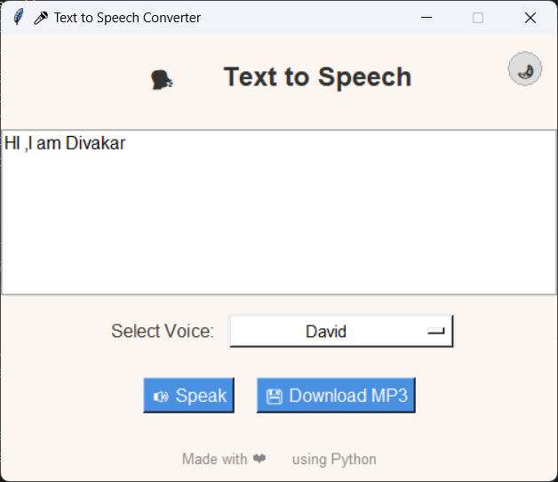
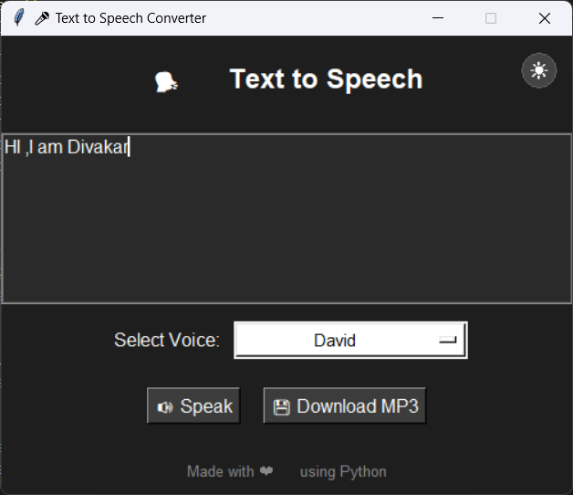

# 🎤 Text to Speech Converter

A simple and attractive Text-to-Speech (TTS) desktop application built with Python and Tkinter. It lets users convert text into speech, choose voices (like David, Zira, Hazel), toggle dark mode, and save audio as `.mp3`.

---

## 🚀 Features

| Feature            | Description                                 |
|--------------------|---------------------------------------------|
| 🗣️ Speak Text       | Converts typed text to voice                |
| 🔁 Voice Selector   | Choose from available TTS voices            |
| 💾 Save as MP3      | Export spoken audio to `.mp3`               |
| 🌙 Dark Mode        | Toggle with a circular button in corner     |
| 🎨 GUI              | Clean and responsive Tkinter interface      |

---

## 📸 Screenshot




---

## 📦 Requirements

- Python 3.6 or higher
- `pyttsx3` for text-to-speech
- `pydub` for audio export
- **FFmpeg** installed and added to system PATH

---

## 📥 Installation

1. **Clone the repository**
   ```bash
   git clone https://github.com/Dynamic-divakar/text-to-speech-gui.git
   cd text-to-speech-gui
   ```

2. **Install dependencies**
   ```bash
   pip install -r requirements.txt
   ```

3. **Install FFmpeg**  
   Download it from [ffmpeg.org](https://ffmpeg.org/download.html) and make sure it's in your system `PATH`.

---

## ▶️ Usage

```bash
python Text-To-Speech.py
```

1. Enter the text in the input area.
2. Select a voice.
3. Click **🔊 Speak** to hear it.
4. Click **💾 Download MP3** to save it.
5. Use the **🌙/☀️** icon at the top-right to toggle between light and dark mode.

---

## 🧠 Notes

- If the dropdown arrow shows as a box (`□`), it's likely a font rendering issue. A manual arrow (▼) is used in this version to ensure consistency.
- The saved MP3 file uses `pydub` which requires FFmpeg.
- Works offline and supports multiple voices via your system’s installed TTS engines.

---

## 🧑‍💻 Author

Created by [Divakar Sathivada](https://github.com/Dynamic-divakar)

---

## 📄 License

This project is open-source and free to use. Licensed under the [MIT License](LICENSE).
